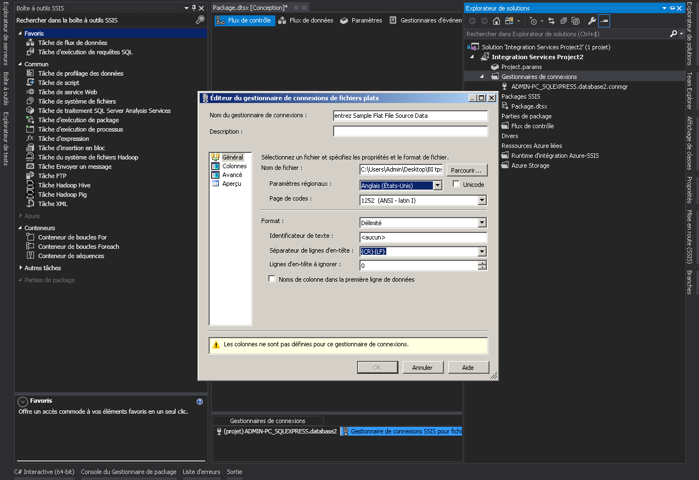
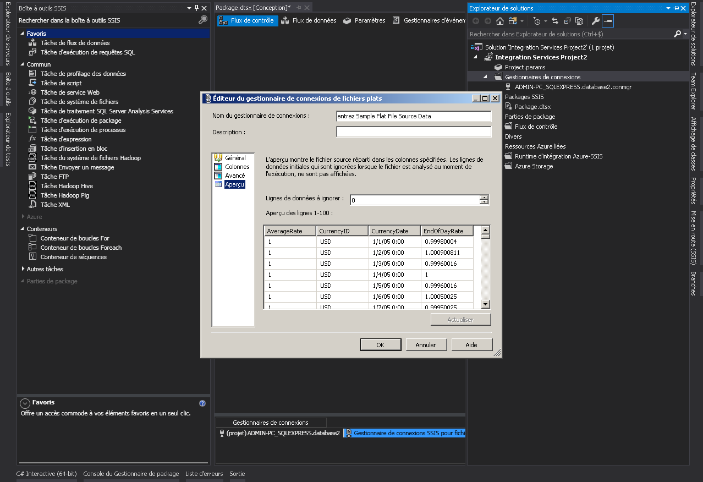
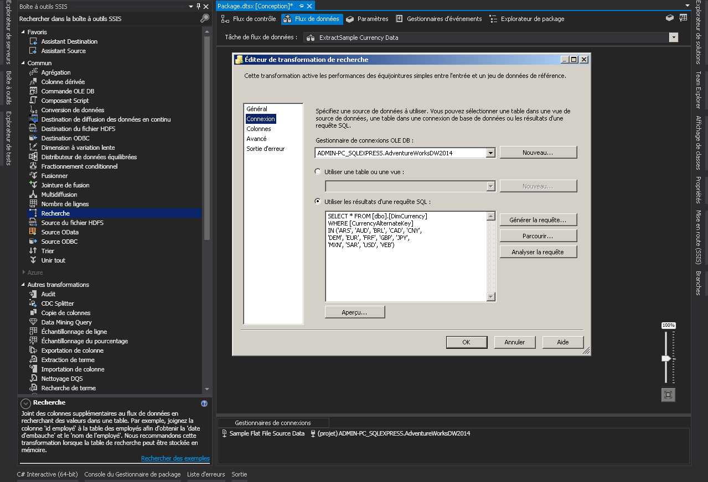
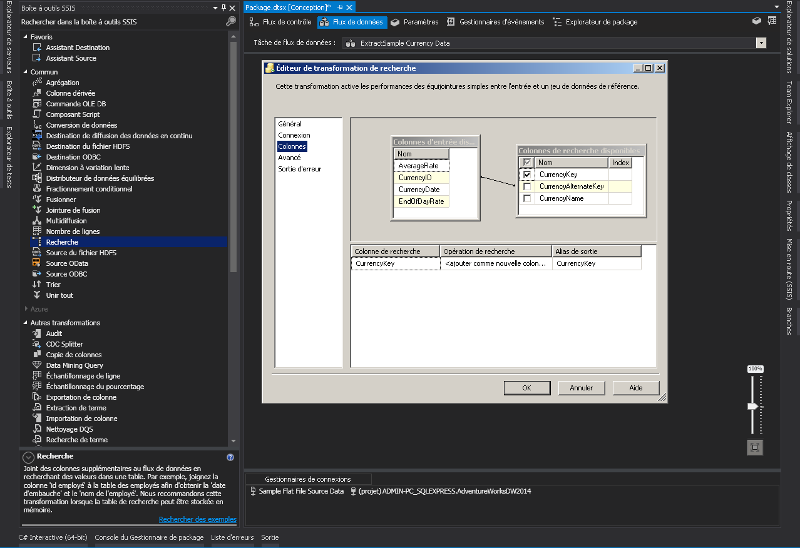
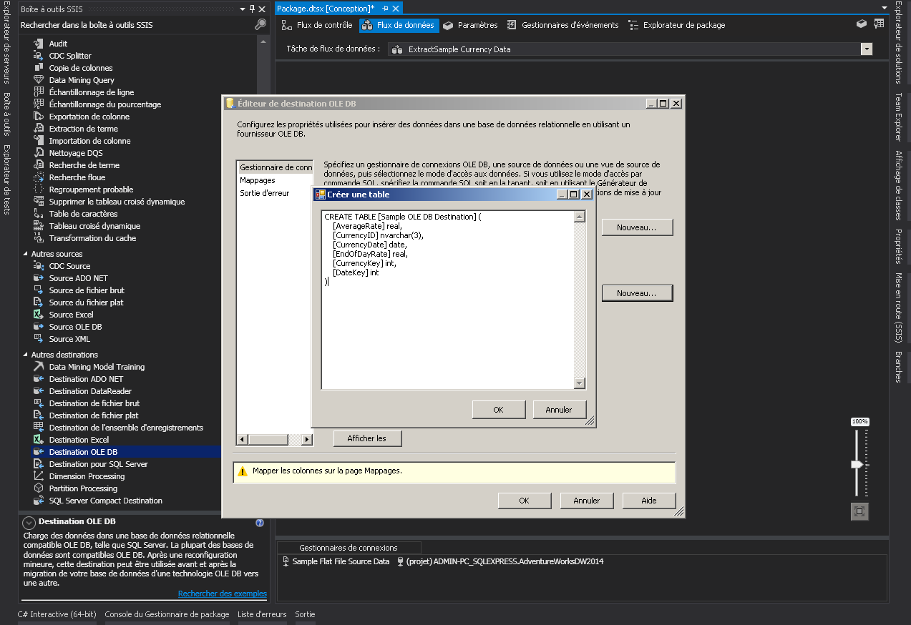
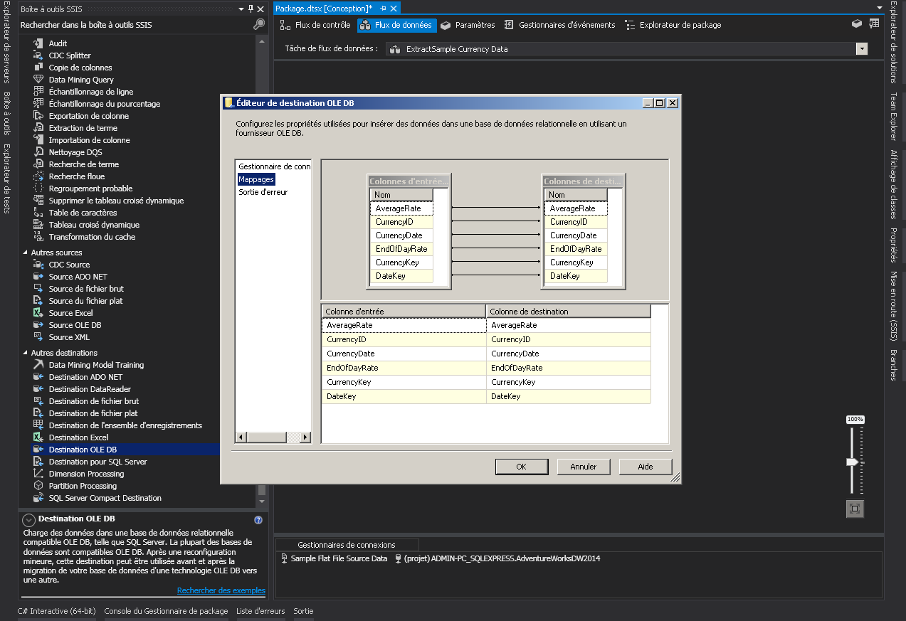
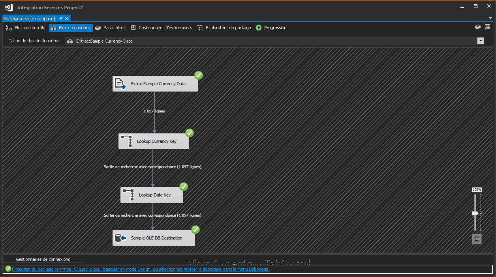
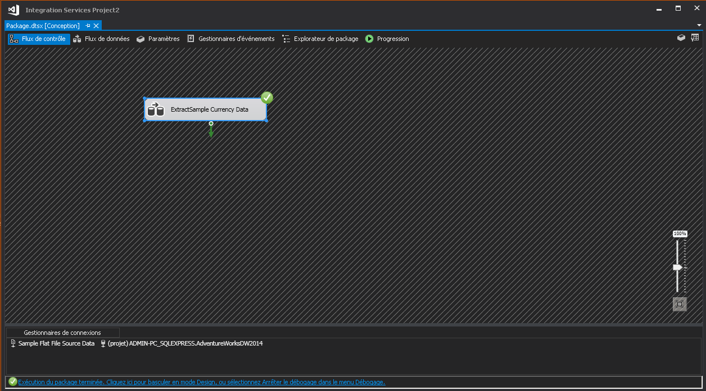
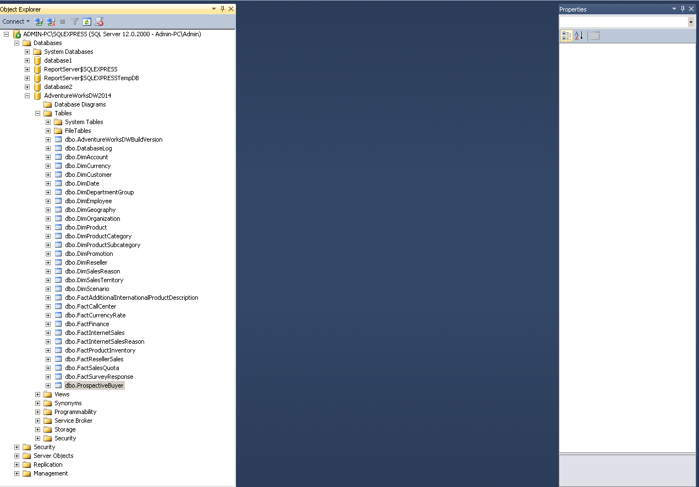
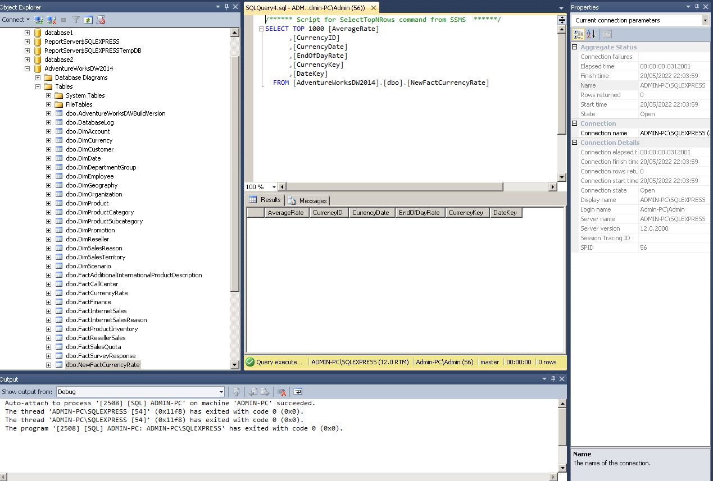

# Créer une connection vers un fichier text

# configurer les transformations de recherche

# configurer la destination OLE DB

# table créer 

# Execution du package

# Résulta dans SQLServer

